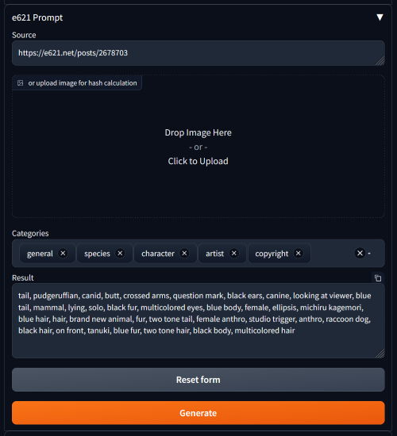

# sd-webui-e621-prompt

Request tags of an image from e621, inspired by [`sd-webui-gelbooru-prompt`](https://github.com/antis0007/sd-webui-gelbooru-prompt).

**Note**: I'm not a Python developer and haven't touched this language for a few years. This extension was hacked together using some other sd-webui extensions sources, stackoverflow answers and pure luck. Feel free to submit PR's fixing this unholy mess.

## Features

- Extract tags from e621 link, post id or md5 hash
- Drag and drop saved images to calculate their md5 automatically
- Configurable prefixes for tag categories (species, character, artist, etc)
- Replace underscores with spaces. Or not.
- Exclude unwanted tags
- Append wanted tags
- Connect to e621 via proxy, for more... "special" parts of the world

## Requirements

- Python 3.10+
- sd-webui v1.3.2 (may work with the previous versions, but untested)

## Development

1. Clone into `extensions` folder
2. `cp .env.example .env` for setting `PYTHONPATH`. It is required for IDE autocompletions to work (tested with vscode, if you use PyCharm your mileage may vary). If you using unix-like OS, replace semicolon with a colon

## Something wrong?

Open an issue on Github if there is some weird error, or use Discussions tab for general questions.

Please adhere to the Github TOS and **do not post** any NSFW imagery or tags in the issues or discussions.
